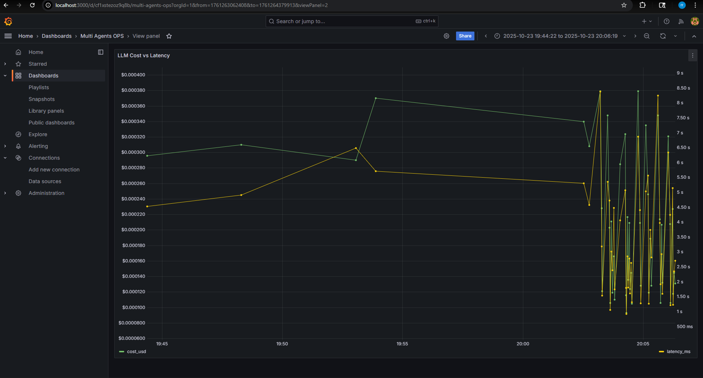
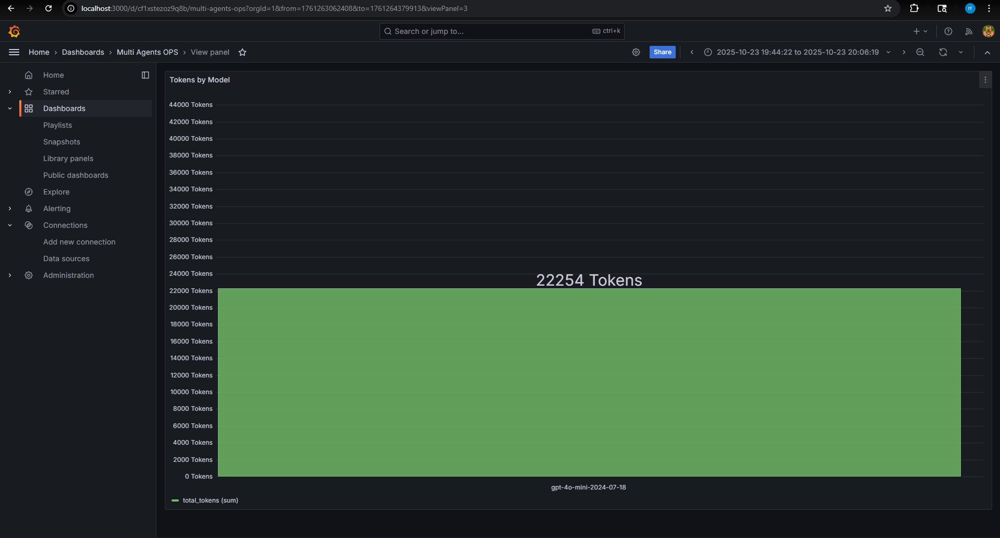
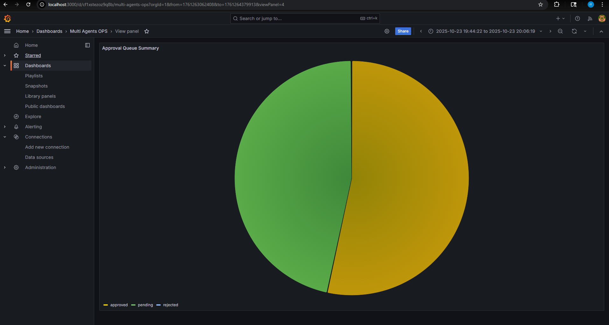
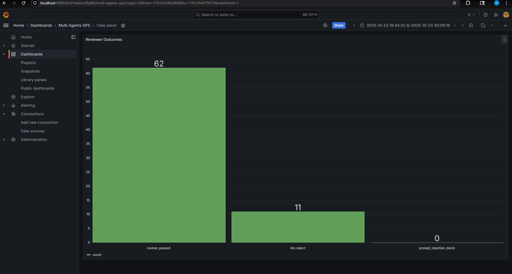
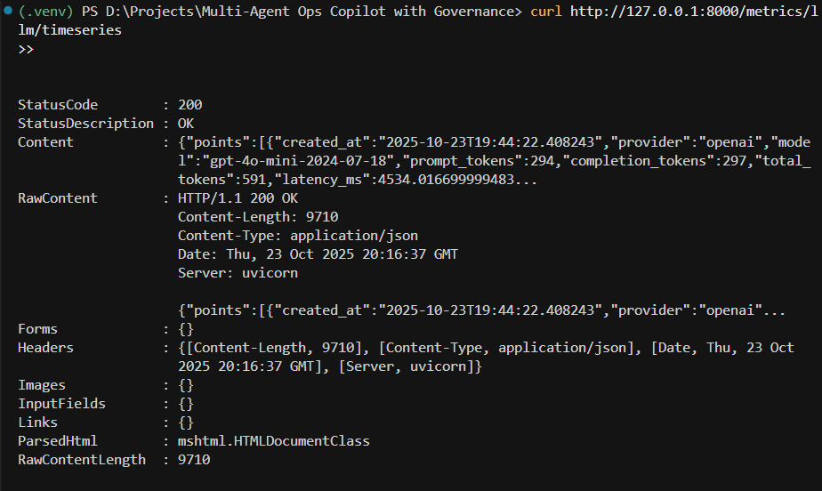

# Multi-Agent Ops Copilot with Governance

An end-to-end multi-agent assistant for operational workflows. A planner, executor, and reviewer coordinate on top of a MiniLM-based RAG index, enforce policy gates, and persist every decision for auditability. The runtime now powers real OpenAI calls (with automatic rate limiting and retries) and ships with live telemetry dashboards.

## Architecture
```
+---------------------------+        +-----------------------+
|        FastAPI API        |        |        Typed CLI      |
+------------+--------------+        +-----------+-----------+
             |                               |
             v                               v
      +-------------+                 +-------------+
      |   Runtime   |<--------------->|  Governance |
      | (Agents +   |                 |  SQLite DB  |
      |  Orchestr.) |                 +-------------+
      +------+------+                        |
             |                               |
   +---------+---------+             +-------+-------+
   |  RAG Retriever    |             |  Tool Adapters |
   | (MiniLM embeddings) |             |  (GitHub/Jira) |
   +---------+---------+             +-------+-------+
             |                               |
             v                               v
        Local Markdown                Sandbox Repo / APIs
```

## Key Features
- **Policy-aware multi-agent loop** – planner decomposes work, executor respects tool policies/approvals, reviewer enforces citations and detects prompt-injection.
- **Semantic RAG** – corpus is embedded with `sentence-transformers/all-MiniLM-L6-v2`; retrieval feeds every agent call.
- **Real LLM providers** – OpenAI (GPT-4o mini) and Azure support out of the box with graceful fallback to the deterministic stub.
- **Governance datastore** – approvals, audits, cost budgets, and LLM usage land in SQLite for easy inspection.
- **Live telemetry** – metrics endpoints and a Grafana dashboard visualize cost, latency, approvals, and reviewer decisions in real time.

## Getting Started
1. **Clone and create a virtual environment**
   ```bash
   python -m venv .venv
   # PowerShell
   . .venv\Scripts\Activate.ps1
   # bash/zsh
   # source .venv/bin/activate
   pip install --upgrade pip
   pip install -r requirements.txt
   ```
2. **Configure environment variables** – copy `.env.example` to `.env` and set at least:
   ```ini
   LLM_PROVIDER=openai        # or "stub" while experimenting
   OPENAI_API_KEY=sk-...
   OPENAI_MODEL=gpt-4o-mini   # optional override
   LLM_RATE_LIMIT_PER_MIN=60  # optional per-minute throttle
   ```
   Azure users can instead populate `AZURE_OPENAI_ENDPOINT`, `AZURE_OPENAI_API_KEY`, and `AZURE_OPENAI_DEPLOYMENT`.
3. **Seed the demo corpus / vector index**
   ```bash
   python scripts/seed_demo.py
   ```
4. **Run the API**
   ```bash
   uvicorn app.main:app --host 0.0.0.0 --port 8000
   ```
5. **Exercise the runtime** – open another shell (venv still active) and run
   ```bash
   python -m app.main demo
   ```
   Repeat (or loop) to populate metrics, approvals, and reviewer outcomes.
6. **Useful automation**
   ```bash
   make format   # format code
   make test     # run pytest suite
   python scripts/export_metrics.py  # export telemetry csv/json
   ```

## Real LLM Usage & Metrics
- OpenAI and Azure providers include automatic backoff, retries, and rate limiting. When a call fails, the runtime falls back to the stub and logs the failure for visibility.
- All usage is persisted to `runtime/ops_copilot.sqlite`:
  - `llm_usage` (provider, model, tokens, latency, cost)
  - `approvals` (status transitions)
  - `audit_logs` (every agent action)
- FastAPI exposes JSON metrics:
  - `GET /metrics/llm/timeseries` – cost, latency, and token counts ordered by timestamp.
  - `GET /metrics/governance/summary` – approvals, reviewer decisions, and reviewer outcome series.
  - `GET /metrics/llm/summary` / `GET /metrics/llm/recent` – aggregated snapshots for quick checks.
- Need a clean slate-> Delete earlier stub rows with:
  ```bash
  python -c "import sqlite3; conn = sqlite3.connect('runtime/ops_copilot.sqlite'); conn.execute('DELETE FROM llm_usage WHERE provider = ''stub'''); conn.commit(); conn.close()"
  ```

## Grafana Dashboard
1. Start Grafana (includes the JSON API plugin):
   ```bash
   docker run -d -p 3000:3000 --name grafana \
     -e GF_INSTALL_PLUGINS=marcusolsson-json-datasource \
     grafana/grafana:10.4.2
   ```
2. Login at `http://localhost:3000` (default `admin` / `admin`).
3. Add a JSON API data source pointing at `http://host.docker.internal:8000` (Linux: replace with the host IP).
4. Build panels using the metrics endpoints:
   - `/metrics/llm/timeseries` -> dual-axis chart of cost vs latency.
   - `/metrics/governance/summary` -> approval queue cards & reviewer outcomes.
   - `/metrics/governance/summary` -> use the `reviewer_outcomes` array for outcome breakdowns.
5. Save the dashboard and let the agents run – every call refreshes the charts automatically.

### Sample Panels
| LLM Cost vs Latency | Tokens by Model | Approval Queue Summary | Reviewer Outcomes | Provider Snapshot |
| --- | --- | --- | --- | --- |
|  |  |  |  |  |

## CLI & Automation Recipes
- `python -m app.main demo` – generate a single governed run.
- `for ($i=1; $i -le 10; $i++) { python -m app.main demo }` – batch runs for load/evaluation (PowerShell).
- `python scripts/export_metrics.py` – dump telemetry to `reports/telemetry/` for offline analysis.
- `make bench` – execute the evaluation harness comparing governed vs baseline agents.

## Tool Integrations
- **GitHub / Jira** – set the relevant secrets and the executor will hit the real APIs. Reviews and approvals remain enforced by policy.
- **Sandbox repo** – mock GitHub writes land under `runtime/sandbox_repo` for diff inspection.
- **Corpus updates** – drop new `.md` files into `app/data/corpus/` and rerun `python scripts/seed_demo.py` to rebuild embeddings.

## Development Notes
- Code is typed and linted (`mypy`, `flake8`, `black`, `isort`).
- Tests cover agent orchestration, governance policies, and RAG helpers (`pytest`).
- Major modules remain ASCII-friendly and include concise inline documentation.

## Roadmap Ideas
- Streaming responses for executor output to lower perceived latency.
- Richer Grafana dashboard exports (Panels-as-Code).
- Governance analytics in the CLI (e.g., `python -m app.main metrics`).

Enjoy building with the Ops Copilot! Contributions, ideas, and issue reports are welcome.
